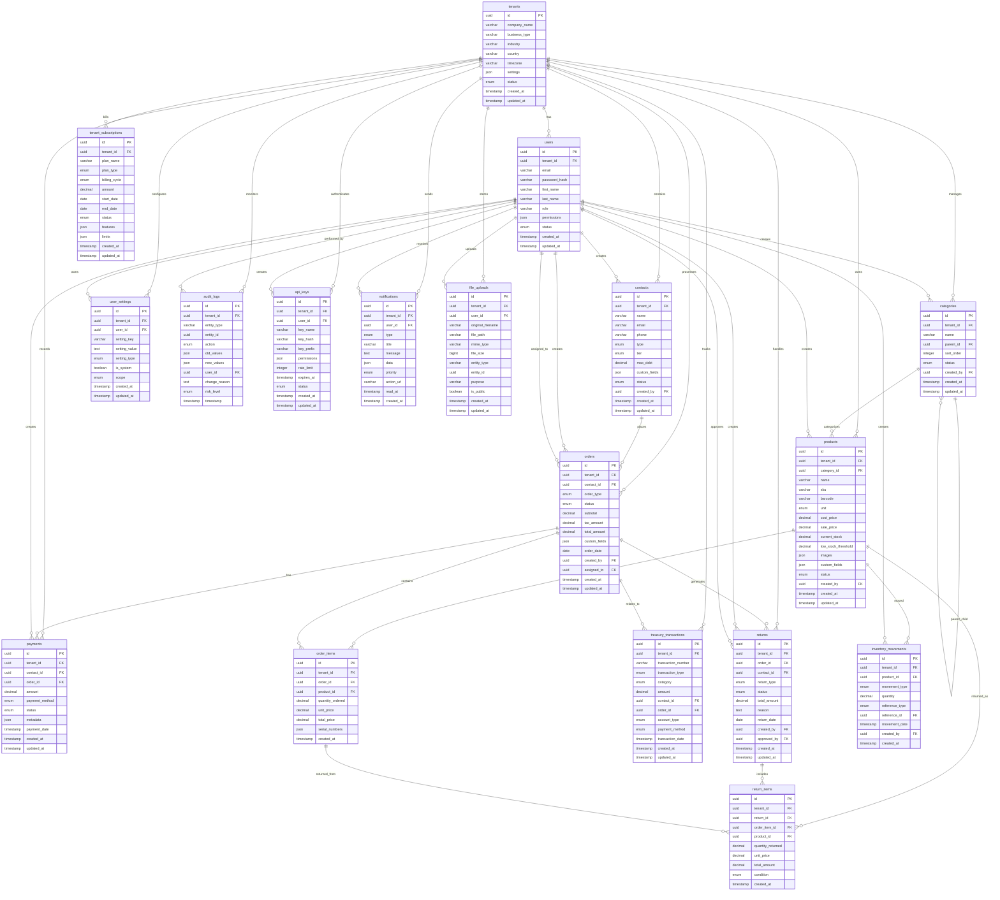

# Database Schema Documentation

## Overview
This document outlines the complete database schema for the Business Management Application, including all entities, relationships, constraints, and indexes required for optimal performance. The application supports multi-tenancy, allowing multiple businesses to use the same database instance with complete data isolation.

## Multi-Tenancy Architecture
The application uses a **shared database, shared schema** approach where each tenant's data is isolated by a `tenant_id` column. This provides:
- Complete data isolation between tenants
- Efficient resource utilization
- Simplified backup and maintenance
- Support for tenant-specific configurations

## Table of Contents
1. [Tenant Management](#tenant-management)
2. [Core Entities](#core-entities)
3. [Transaction Entities](#transaction-entities)
4. [Supporting Entities](#supporting-entities)
5. [Relationships](#relationships)
6. [Indexes and Constraints](#indexes-and-constraints)
7. [Data Types Reference](#data-types-reference)
8. [Multi-Tenant Considerations](#multi-tenant-considerations)

---

## Entity Relationship Diagram (ERD)



---

## Tenant Management

### 0. tenants
Master tenant/company configuration table.

| Field | Type | Constraints | Description |
|-------|------|-------------|-------------|
| id | UUID | PRIMARY KEY | Unique tenant identifier |
| company_name | VARCHAR(255) | NOT NULL | Company/business name |
| company_name_ar | VARCHAR(255) | NULL | Arabic company name |
| subdomain | VARCHAR(100) | NULL, UNIQUE | Custom subdomain for SaaS |
| domain | VARCHAR(255) | NULL, UNIQUE | Custom domain for enterprise |
| business_type | ENUM | NOT NULL | 'retail', 'wholesale', 'manufacturing', 'services' |
| industry | VARCHAR(100) | NULL | Industry classification |
| country | VARCHAR(100) | NOT NULL | Country of operation |
| timezone | VARCHAR(50) | DEFAULT 'UTC' | Business timezone |
| currency | VARCHAR(3) | DEFAULT 'SAR' | Primary currency |
| language | VARCHAR(5) | DEFAULT 'en' | Primary language |
| fiscal_year_start | DATE | NULL | Start of fiscal year |
| logo_url | VARCHAR(500) | NULL | Company logo URL |
| settings | JSON | NULL | Tenant-specific settings |
| subscription_plan | ENUM | DEFAULT 'basic' | 'basic', 'premium', 'enterprise' |
| subscription_status | ENUM | DEFAULT 'active' | 'active', 'suspended', 'cancelled' |
| subscription_expires_at | TIMESTAMP | NULL | Subscription expiry date |
| max_users | INTEGER | DEFAULT 5 | Maximum allowed users |
| max_contacts | INTEGER | DEFAULT 1000 | Maximum contacts |
| max_products | INTEGER | DEFAULT 10000 | Maximum products |
| max_orders | INTEGER | DEFAULT NULL | Maximum orders (unlimited if NULL) |
| features | JSON | NULL | Enabled/disabled features |
| api_enabled | BOOLEAN | DEFAULT FALSE | API access enabled |
| backup_enabled | BOOLEAN | DEFAULT TRUE | Automated backups enabled |
| status | ENUM | DEFAULT 'active' | 'active', 'suspended', 'cancelled', 'trial' |
| created_at | TIMESTAMP | NOT NULL | Creation timestamp |
| updated_at | TIMESTAMP | NOT NULL | Last update timestamp |

### 1. users
Application users with tenant association.

| Field | Type | Constraints | Description |
|-------|------|-------------|-------------|
| id | UUID | PRIMARY KEY | Unique user identifier |
| tenant_id | UUID | NOT NULL, FOREIGN KEY | Tenant reference |
| email | VARCHAR(255) | NOT NULL, UNIQUE WITHIN TENANT | User email (unique per tenant) |
| password_hash | VARCHAR(255) | NOT NULL | Hashed password |
| first_name | VARCHAR(100) | NOT NULL | User first name |
| last_name | VARCHAR(100) | NOT NULL | User last name |
| role | ENUM | NOT NULL | User role |
| permissions | JSON | NULL | Custom permissions |
| phone | VARCHAR(50) | NULL | Phone number |
| avatar_url | VARCHAR(500) | NULL | Profile image URL |
| language | VARCHAR(5) | DEFAULT 'en' | Preferred language |
| timezone | VARCHAR(50) | DEFAULT 'UTC' | User timezone |
| last_login_at | TIMESTAMP | NULL | Last login timestamp |
| login_count | INTEGER | DEFAULT 0 | Total login count |
| password_changed_at | TIMESTAMP | NOT NULL | Last password change |
| email_verified_at | TIMESTAMP | NULL | Email verification timestamp |
| status | ENUM | DEFAULT 'active' | 'active', 'inactive', 'suspended' |
| created_at | TIMESTAMP | NOT NULL | Creation timestamp |
| updated_at | TIMESTAMP | NOT NULL | Last update timestamp |

**User Roles:**
- `'owner'` - Full access to tenant data
- `'admin'` - Administrative access
- `'manager'` - Management level access
- `'employee'` - Standard employee access
- `'viewer'` - Read-only access

---

## Core Entities

### 2. contacts
Primary entity for both customers and vendors.

| Field | Type | Constraints | Description |
|-------|------|-------------|-------------|
| id | UUID | PRIMARY KEY | Unique identifier |
| tenant_id | UUID | NOT NULL, FOREIGN KEY | Tenant reference |
| name | VARCHAR(255) | NOT NULL | Contact name |
| name_ar | VARCHAR(255) | NULL | Arabic contact name |
| email | VARCHAR(255) | NULL | Email address |
| phone | VARCHAR(50) | NULL | Phone number |
| mobile | VARCHAR(50) | NULL | Mobile number |
| fax | VARCHAR(50) | NULL | Fax number |
| address | TEXT | NULL | Full address |
| city | VARCHAR(100) | NULL | City |
| state_province | VARCHAR(100) | NULL | State/Province |
| postal_code | VARCHAR(20) | NULL | Postal/ZIP code |
| country | VARCHAR(100) | NULL | Country |
| tax_number | VARCHAR(50) | NULL | Tax/VAT number |
| type | ENUM | NOT NULL | 'customer', 'vendor' |
| tier | ENUM | NULL | 'bronze', 'silver', 'gold' |
| max_debt | DECIMAL(15,2) | DEFAULT 0.00 | Maximum credit limit |
| opening_balance | DECIMAL(15,2) | DEFAULT 0.00 | Opening balance |
| total_sales | DECIMAL(15,2) | DEFAULT 0.00 | Total sales amount |
| total_purchases | DECIMAL(15,2) | DEFAULT 0.00 | Total purchases amount |
| avatar_url | VARCHAR(500) | NULL | Profile image URL |
| social_links | JSON | NULL | Social media links |
| custom_fields | JSON | NULL | Custom field values |
| status | ENUM | DEFAULT 'active' | 'active', 'inactive', 'suspended' |
| created_by | UUID | NULL, FOREIGN KEY | User who created this contact |
| created_at | TIMESTAMP | NOT NULL | Creation timestamp |
| updated_at | TIMESTAMP | NOT NULL | Last update timestamp |

### 3. categories
Product categorization system.

| Field | Type | Constraints | Description |
|-------|------|-------------|-------------|
| id | UUID | PRIMARY KEY | Unique identifier |
| tenant_id | UUID | NOT NULL, FOREIGN KEY | Tenant reference |
| name | VARCHAR(100) | NOT NULL | Category name |
| name_ar | VARCHAR(100) | NULL | Arabic category name |
| description | TEXT | NULL | Category description |
| parent_id | UUID | NULL, FOREIGN KEY | Parent category for hierarchy |
| sort_order | INTEGER | DEFAULT 0 | Display order |
| color | VARCHAR(7) | NULL | Hex color code for UI |
| icon | VARCHAR(50) | NULL | Icon name for UI |
| status | ENUM | DEFAULT 'active' | 'active', 'inactive' |
| created_by | UUID | NULL, FOREIGN KEY | User who created this category |
| created_at | TIMESTAMP | NOT NULL | Creation timestamp |
| updated_at | TIMESTAMP | NOT NULL | Last update timestamp |

### 4. products
Inventory items with comprehensive product information.

| Field | Type | Constraints | Description |
|-------|------|-------------|-------------|
| id | UUID | PRIMARY KEY | Unique identifier |
| tenant_id | UUID | NOT NULL, FOREIGN KEY | Tenant reference |
| name | VARCHAR(255) | NOT NULL | Product name |
| name_ar | VARCHAR(255) | NULL | Arabic product name |
| description | TEXT | NULL | Product description |
| description_ar | TEXT | NULL | Arabic product description |
| sku | VARCHAR(100) | NOT NULL | Stock Keeping Unit (unique per tenant) |
| barcode | VARCHAR(100) | NULL | Barcode for scanning |
| qr_code | VARCHAR(255) | NULL | QR Code content |
| category_id | UUID | NOT NULL, FOREIGN KEY | Product category |
| unit | ENUM | DEFAULT 'piece' | 'piece', 'kg', 'meter', 'liter', 'box', 'pack' |
| cost_price | DECIMAL(15,2) | NOT NULL | Purchase price |
| sale_price | DECIMAL(15,2) | NOT NULL | Selling price |
| lowest_sell_price | DECIMAL(15,2) | DEFAULT 0.00 | Minimum selling price |
| wholesale_price | DECIMAL(15,2) | NULL | Wholesale price |
| retail_price | DECIMAL(15,2) | NULL | Retail price |
| opening_quantity | DECIMAL(10,3) | DEFAULT 0 | Initial stock quantity |
| current_stock | DECIMAL(10,3) | DEFAULT 0 | Current inventory level |
| reserved_stock | DECIMAL(10,3) | DEFAULT 0 | Reserved for orders |
| available_stock | DECIMAL(10,3) | DEFAULT 0 | Available for sale |
| low_stock_threshold | DECIMAL(10,3) | DEFAULT 10 | Low stock alert level |
| weight | DECIMAL(8,3) | NULL | Product weight |
| dimensions | VARCHAR(100) | NULL | Product dimensions (L x W x H) |
| brand | VARCHAR(100) | NULL | Brand name |
| model | VARCHAR(100) | NULL | Model number |
| color | VARCHAR(50) | NULL | Color variant |
| size | VARCHAR(50) | NULL | Size variant |
| images | JSON | NULL | Array of image URLs |
| attachments | JSON | NULL | Array of file attachments |
| custom_fields | JSON | NULL | Custom field values |
| seo_title | VARCHAR(255) | NULL | SEO title |
| seo_description | TEXT | NULL | SEO description |
| tags | JSON | NULL | Array of tags |
| status | ENUM | DEFAULT 'active' | 'active', 'inactive', 'discontinued', 'out_of_stock' |
| track_inventory | BOOLEAN | DEFAULT TRUE | Whether to track inventory |
| allow_backorders | BOOLEAN | DEFAULT FALSE | Allow orders when out of stock |
| is_service | BOOLEAN | DEFAULT FALSE | Is this a service product |
| created_by | UUID | NULL, FOREIGN KEY | User who created this product |
| created_at | TIMESTAMP | NOT NULL | Creation timestamp |
| updated_at | TIMESTAMP | NOT NULL | Last update timestamp |

---

## Transaction Entities

### 5. orders
Main order/invoice entity for both sales and purchases.

| Field | Type | Constraints | Description |
|-------|------|-------------|-------------|
| id | UUID | PRIMARY KEY | Unique identifier |
| tenant_id | UUID | NOT NULL, FOREIGN KEY | Tenant reference |
| order_number | VARCHAR(50) | NOT NULL | Human-readable order number (unique per tenant) |
| order_type | ENUM | NOT NULL | 'sales', 'purchase' |
| contact_id | UUID | NOT NULL, FOREIGN KEY | Customer or vendor |
| status | ENUM | NOT NULL | Order status (see below) |
| priority | ENUM | DEFAULT 'normal' | 'low', 'normal', 'high', 'urgent' |
| order_date | DATE | NOT NULL | Order creation date |
| delivery_date | DATE | NULL | Scheduled delivery date |
| due_date | DATE | NULL | Payment due date |
| subtotal | DECIMAL(15,2) | NOT NULL | Items total before tax/discount |
| discount_percentage | DECIMAL(5,2) | DEFAULT 0.00 | Overall discount percentage |
| discount_amount | DECIMAL(15,2) | DEFAULT 0.00 | Total discount applied |
| shipping_cost | DECIMAL(15,2) | DEFAULT 0.00 | Shipping cost |
| handling_cost | DECIMAL(15,2) | DEFAULT 0.00 | Handling cost |
| tax_rate | DECIMAL(5,2) | DEFAULT 0.00 | Tax percentage |
| tax_amount | DECIMAL(15,2) | DEFAULT 0.00 | Calculated tax |
| total_amount | DECIMAL(15,2) | NOT NULL | Final total amount |
| paid_amount | DECIMAL(15,2) | DEFAULT 0.00 | Amount paid so far |
| unpaid_amount | DECIMAL(15,2) | NOT NULL | Remaining balance |
| currency | VARCHAR(3) | DEFAULT 'SAR' | Currency code |
| exchange_rate | DECIMAL(10,6) | DEFAULT 1.000000 | Exchange rate if different currency |
| shipping_address | TEXT | NULL | Shipping address |
| billing_address | TEXT | NULL | Billing address |
| payment_terms | VARCHAR(100) | NULL | Payment terms |
| delivery_method | VARCHAR(100) | NULL | Delivery method |
| tracking_number | VARCHAR(100) | NULL | Tracking number for shipments |
| internal_notes | TEXT | NULL | Internal notes (not visible to customer) |
| customer_notes | TEXT | NULL | Notes visible to customer |
| attachments | JSON | NULL | Array of file attachments |
| custom_fields | JSON | NULL | Custom field values |
| created_by | UUID | NULL, FOREIGN KEY | User who created this order |
| assigned_to | UUID | NULL, FOREIGN KEY | User assigned to handle this order |
| created_at | TIMESTAMP | NOT NULL | Creation timestamp |
| updated_at | TIMESTAMP | NOT NULL | Last update timestamp |

**Order Status Values:**
- For Sales: 'draft', 'pending', 'confirmed', 'processing', 'shipped', 'delivered', 'cancelled', 'returned'
- For Purchases: 'draft', 'pending', 'approved', 'ordered', 'received', 'cancelled', 'returned'

### 6. order_items
Line items within each order.

| Field | Type | Constraints | Description |
|-------|------|-------------|-------------|
| id | UUID | PRIMARY KEY | Unique identifier |
| tenant_id | UUID | NOT NULL, FOREIGN KEY | Tenant reference |
| order_id | UUID | NOT NULL, FOREIGN KEY | Reference to order |
| product_id | UUID | NOT NULL, FOREIGN KEY | Product reference |
| item_number | INTEGER | NOT NULL | Sequence number within order |
| quantity_ordered | DECIMAL(10,3) | NOT NULL | Quantity originally ordered |
| quantity_delivered | DECIMAL(10,3) | DEFAULT 0.000 | Quantity delivered |
| quantity_remaining | DECIMAL(10,3) | NOT NULL | Quantity remaining to deliver |
| unit_price | DECIMAL(15,2) | NOT NULL | Price per unit |
| cost_price | DECIMAL(15,2) | NULL | Cost price for profit calculation |
| discount_percentage | DECIMAL(5,2) | DEFAULT 0.00 | Line item discount % |
| discount_amount | DECIMAL(15,2) | DEFAULT 0.00 | Line item discount amount |
| tax_rate | DECIMAL(5,2) | DEFAULT 0.00 | Tax rate for this item |
| tax_amount | DECIMAL(15,2) | DEFAULT 0.00 | Calculated tax amount |
| total_price | DECIMAL(15,2) | NOT NULL | Final line total |
| total_cost | DECIMAL(15,2) | NOT NULL | Total cost for profit calculation |
| profit_margin | DECIMAL(5,2) | NULL | Calculated profit margin percentage |
| notes | TEXT | NULL | Item-specific notes |
| serial_numbers | JSON | NULL | Array of serial numbers for this item |
| batch_numbers | JSON | NULL | Array of batch numbers |
| expiry_dates | JSON | NULL | Array of expiry dates |
| created_at | TIMESTAMP | NOT NULL | Creation timestamp |

### 7. payments
Payment transactions (both receipts and payments).

| Field | Type | Constraints | Description |
|-------|------|-------------|-------------|
| id | UUID | PRIMARY KEY | Unique identifier |
| tenant_id | UUID | NOT NULL, FOREIGN KEY | Tenant reference |
| transaction_number | VARCHAR(50) | NOT NULL | Transaction reference (unique per tenant) |
| payment_type | ENUM | NOT NULL | 'receipt', 'payment' |
| contact_id | UUID | NOT NULL, FOREIGN KEY | Customer or vendor |
| order_id | UUID | NULL, FOREIGN KEY | Associated order (optional) |
| amount | DECIMAL(15,2) | NOT NULL | Payment amount |
| currency | VARCHAR(3) | NOT NULL | Payment currency |
| exchange_rate | DECIMAL(10,6) | DEFAULT 1.000000 | Exchange rate if different currency |
| payment_method | ENUM | NOT NULL | Payment method type |
| reference_number | VARCHAR(100) | NULL | External reference |
| cheque_number | VARCHAR(50) | NULL | Cheque number |
| bank_name | VARCHAR(100) | NULL | Bank name |
| account_number | VARCHAR(50) | NULL | Account number |
| description | TEXT | NULL | Payment description |
| transaction_date | TIMESTAMP | NOT NULL | Payment timestamp |
| cleared_date | TIMESTAMP | NULL | Date payment cleared |
| reconciled | BOOLEAN | DEFAULT FALSE | Whether payment is reconciled |
| reconciled_date | TIMESTAMP | NULL | Date of reconciliation |
| created_by | UUID | NULL, FOREIGN KEY | User who recorded this payment |
| created_at | TIMESTAMP | NOT NULL | Creation timestamp |
| updated_at | TIMESTAMP | NOT NULL | Last update timestamp |

**Payment Methods:**
- 'cash', 'credit_card', 'debit_card', 'bank_transfer', 'check', 'paypal', 'stripe', 'other'

### 8. returns
Product returns and exchanges.

| Field | Type | Constraints | Description |
|-------|------|-------------|-------------|
| id | UUID | PRIMARY KEY | Unique identifier |
| tenant_id | UUID | NOT NULL, FOREIGN KEY | Tenant reference |
| return_number | VARCHAR(50) | NOT NULL | Return reference (unique per tenant) |
| order_id | UUID | NOT NULL, FOREIGN KEY | Original order |
| contact_id | UUID | NOT NULL, FOREIGN KEY | Customer returning items |
| return_type | ENUM | NOT NULL | 'return', 'exchange', 'refund', 'credit_note' |
| status | ENUM | DEFAULT 'pending' | 'pending', 'approved', 'processed', 'rejected', 'completed' |
| priority | ENUM | DEFAULT 'normal' | 'low', 'normal', 'high' |
| return_date | DATE | NOT NULL | Date of return |
| approved_date | DATE | NULL | Date return was approved |
| processed_date | DATE | NULL | Date processed |
| total_amount | DECIMAL(15,2) | NOT NULL | Total return value |
| refund_amount | DECIMAL(15,2) | DEFAULT 0.00 | Actual refund amount |
| restocking_fee | DECIMAL(15,2) | DEFAULT 0.00 | Restocking fee deducted |
| reason | ENUM | NULL | Return reason category |
| reason_details | TEXT | NULL | Detailed reason |
| condition | ENUM | NULL | Overall condition of returned items |
| internal_notes | TEXT | NULL | Internal notes |
| customer_notes | TEXT | NULL | Notes from customer |
| attachments | JSON | NULL | Array of file attachments |
| created_by | UUID | NULL, FOREIGN KEY | User who created this return |
| approved_by | UUID | NULL, FOREIGN KEY | User who approved this return |
| created_at | TIMESTAMP | NOT NULL | Creation timestamp |
| updated_at | TIMESTAMP | NOT NULL | Last update timestamp |

### 9. return_items
Individual items being returned.

| Field | Type | Constraints | Description |
|-------|------|-------------|-------------|
| id | UUID | PRIMARY KEY | Unique identifier |
| tenant_id | UUID | NOT NULL, FOREIGN KEY | Tenant reference |
| return_id | UUID | NOT NULL, FOREIGN KEY | Return reference |
| order_item_id | UUID | NOT NULL, FOREIGN KEY | Original order item |
| product_id | UUID | NOT NULL, FOREIGN KEY | Product reference |
| quantity_ordered | DECIMAL(10,3) | NOT NULL | Original quantity ordered |
| quantity_returned | DECIMAL(10,3) | NOT NULL | Quantity being returned |
| unit_price | DECIMAL(15,2) | NOT NULL | Unit price at time of order |
| refund_unit_price | DECIMAL(15,2) | NULL | Unit price for refund (may differ) |
| discount_amount | DECIMAL(15,2) | DEFAULT 0.00 | Discount amount for this item |
| total_amount | DECIMAL(15,2) | NOT NULL | Total return value for this item |
| refund_amount | DECIMAL(15,2) | NOT NULL | Actual refund amount |
| condition | ENUM | NULL | 'new', 'used', 'damaged', 'defective' |
| damage_description | TEXT | NULL | Description of damage/defects |
| serial_number | VARCHAR(100) | NULL | Serial number if applicable |
| batch_number | VARCHAR(100) | NULL | Batch number if applicable |
| expiry_date | DATE | NULL | Expiry date if applicable |
| restocking_fee | DECIMAL(15,2) | DEFAULT 0.00 | Restocking fee for this item |
| notes | TEXT | NULL | Item-specific notes |
| inspection_notes | TEXT | NULL | Notes from inspection |
| photos | JSON | NULL | Array of photo URLs |
| created_at | TIMESTAMP | NOT NULL | Creation timestamp |

---

## Supporting Entities

### 10. treasury_transactions
General financial transactions for cash flow tracking.

| Field | Type | Constraints | Description |
|-------|------|-------------|-------------|
| id | UUID | PRIMARY KEY | Unique identifier |
| tenant_id | UUID | NOT NULL, FOREIGN KEY | Tenant reference |
| transaction_number | VARCHAR(50) | NOT NULL | Treasury reference (unique per tenant) |
| transaction_type | ENUM | NOT NULL | 'receipt', 'payment', 'transfer', 'adjustment' |
| category | ENUM | NOT NULL | Transaction category |
| subcategory | VARCHAR(100) | NULL | More specific categorization |
| amount | DECIMAL(15,2) | NOT NULL | Transaction amount |
| currency | VARCHAR(3) | DEFAULT 'SAR' | Transaction currency |
| exchange_rate | DECIMAL(10,6) | DEFAULT 1.000000 | Exchange rate if different currency |
| balance_before | DECIMAL(15,2) | NOT NULL | Balance before transaction |
| balance_after | DECIMAL(15,2) | NOT NULL | Balance after transaction |
| account_type | ENUM | NOT NULL | 'cash', 'bank', 'credit_card', 'paypal' |
| contact_id | UUID | NULL, FOREIGN KEY | Related contact |
| order_id | UUID | NULL, FOREIGN KEY | Related order |
| payment_method | ENUM | NOT NULL | Payment method used |
| reference_number | VARCHAR(100) | NULL | External reference |
| cheque_number | VARCHAR(50) | NULL | Cheque number |
| bank_name | VARCHAR(100) | NULL | Bank name |
| description | TEXT | NULL | Transaction description |
| tags | JSON | NULL | Array of tags for categorization |
| location | VARCHAR(100) | NULL | Location or department |
| project | VARCHAR(100) | NULL | Associated project |
| transaction_date | TIMESTAMP | NOT NULL | Transaction timestamp |
| cleared_date | TIMESTAMP | NULL | Date transaction cleared |
| reconciled | BOOLEAN | DEFAULT FALSE | Whether transaction is reconciled |
| reconciled_date | TIMESTAMP | NULL | Date of reconciliation |
| reconciled_by | UUID | NULL, FOREIGN KEY | User who reconciled transaction |
| attachments | JSON | NULL | Array of file attachments |
| created_by | UUID | NULL, FOREIGN KEY | User who recorded transaction |
| created_at | TIMESTAMP | NOT NULL | Creation timestamp |
| updated_at | TIMESTAMP | NOT NULL | Last update timestamp |

**Treasury Categories:**
- 'sales', 'purchase', 'refund', 'expense', 'income', 'transfer', 'payroll', 'utilities', 'rent', 'marketing'

### 11. inventory_movements
Inventory stock movements for tracking all inventory changes.

| Field | Type | Constraints | Description |
|-------|------|-------------|-------------|
| id | UUID | PRIMARY KEY | Unique identifier |
| tenant_id | UUID | NOT NULL, FOREIGN KEY | Tenant reference |
| product_id | UUID | NOT NULL, FOREIGN KEY | Product reference |
| movement_type | ENUM | NOT NULL | 'in', 'out', 'transfer', 'adjustment', 'return', 'damaged' |
| quantity | DECIMAL(10,3) | NOT NULL | Quantity moved |
| unit_cost | DECIMAL(15,2) | NULL | Unit cost for inventory valuation |
| total_cost | DECIMAL(15,2) | NULL | Total cost of movement |
| reference_type | ENUM | NULL | 'order', 'return', 'adjustment', 'transfer' |
| reference_id | UUID | NULL, FOREIGN KEY | Reference to source document |
| from_location | VARCHAR(100) | NULL | Source location/warehouse |
| to_location | VARCHAR(100) | NULL | Destination location/warehouse |
| batch_number | VARCHAR(100) | NULL | Batch number |
| serial_numbers | JSON | NULL | Array of serial numbers |
| expiry_date | DATE | NULL | Expiry date |
| reason | VARCHAR(255) | NULL | Reason for movement |
| notes | TEXT | NULL | Additional notes |
| movement_date | TIMESTAMP | NOT NULL | Date of movement |
| created_by | UUID | NULL, FOREIGN KEY | User who recorded movement |
| created_at | TIMESTAMP | NOT NULL | Creation timestamp |

### 12. user_settings
Application configuration and user preferences.

| Field | Type | Constraints | Description |
|-------|------|-------------|-------------|
| id | UUID | PRIMARY KEY | Unique identifier |
| tenant_id | UUID | NULL, FOREIGN KEY | Tenant reference (NULL for system settings) |
| user_id | UUID | NULL, FOREIGN KEY | User reference (NULL for tenant settings) |
| setting_key | VARCHAR(100) | NOT NULL | Setting identifier |
| setting_value | TEXT | NULL | Setting value |
| setting_type | ENUM | DEFAULT 'string' | 'string', 'number', 'boolean', 'json', 'array' |
| description | TEXT | NULL | Setting description |
| is_system | BOOLEAN | DEFAULT FALSE | System vs user setting |
| is_encrypted | BOOLEAN | DEFAULT FALSE | Whether value is encrypted |
| scope | ENUM | DEFAULT 'user' | 'system', 'tenant', 'user' |
| created_at | TIMESTAMP | NOT NULL | Creation timestamp |
| updated_at | TIMESTAMP | NOT NULL | Last update timestamp |

### 13. audit_logs
System audit trail for important changes.

| Field | Type | Constraints | Description |
|-------|------|-------------|-------------|
| id | UUID | PRIMARY KEY | Unique identifier |
| tenant_id | UUID | NOT NULL, FOREIGN KEY | Tenant reference |
| entity_type | VARCHAR(50) | NOT NULL | Type of entity changed |
| entity_id | UUID | NOT NULL | ID of changed entity |
| action | ENUM | NOT NULL | 'create', 'update', 'delete', 'login', 'logout' |
| field_changes | JSON | NULL | Specific field changes |
| old_values | JSON | NULL | Previous values (full snapshot) |
| new_values | JSON | NULL | New values (full snapshot) |
| user_id | UUID | NULL, FOREIGN KEY | User who made change |
| ip_address | VARCHAR(45) | NULL | IP address of user |
| user_agent | TEXT | NULL | User agent string |
| session_id | VARCHAR(255) | NULL | Session identifier |
| change_reason | TEXT | NULL | Reason for change |
| risk_level | ENUM | DEFAULT 'low' | 'low', 'medium', 'high', 'critical' |
| api_endpoint | VARCHAR(255) | NULL | API endpoint if web request |
| timestamp | TIMESTAMP | NOT NULL | Change timestamp |

### 14. tenant_subscriptions
Subscription and billing information for tenants.

| Field | Type | Constraints | Description |
|-------|------|-------------|-------------|
| id | UUID | PRIMARY KEY | Unique identifier |
| tenant_id | UUID | NOT NULL, FOREIGN KEY | Tenant reference |
| plan_name | VARCHAR(100) | NOT NULL | Subscription plan name |
| plan_type | ENUM | NOT NULL | 'trial', 'basic', 'premium', 'enterprise' |
| billing_cycle | ENUM | NOT NULL | 'monthly', 'quarterly', 'yearly' |
| amount | DECIMAL(10,2) | NOT NULL | Subscription amount |
| currency | VARCHAR(3) | DEFAULT 'USD' | Billing currency |
| start_date | DATE | NOT NULL | Subscription start date |
| end_date | DATE | NULL | Subscription end date |
| next_billing_date | DATE | NULL | Next billing date |
| auto_renew | BOOLEAN | DEFAULT TRUE | Auto-renewal enabled |
| payment_method | VARCHAR(100) | NULL | Payment method used |
| stripe_subscription_id | VARCHAR(255) | NULL | Stripe subscription ID |
| status | ENUM | DEFAULT 'active' | 'active', 'cancelled', 'past_due', 'unpaid' |
| trial_used | BOOLEAN | DEFAULT FALSE | Whether trial period was used |
| features | JSON | NULL | Enabled features for this plan |
| limits | JSON | NULL | Plan limits (users, storage, etc.) |
| created_at | TIMESTAMP | NOT NULL | Creation timestamp |
| updated_at | TIMESTAMP | NOT NULL | Last update timestamp |

### 15. api_keys
API keys for tenant API access.

| Field | Type | Constraints | Description |
|-------|------|-------------|-------------|
| id | UUID | PRIMARY KEY | Unique identifier |
| tenant_id | UUID | NOT NULL, FOREIGN KEY | Tenant reference |
| user_id | UUID | NULL, FOREIGN KEY | User who created this key |
| key_name | VARCHAR(100) | NOT NULL | Name/description of API key |
| key_hash | VARCHAR(255) | NOT NULL, UNIQUE | Hashed API key |
| key_prefix | VARCHAR(20) | NOT NULL | First few characters for identification |
| permissions | JSON | NULL | API permissions |
| rate_limit | INTEGER | DEFAULT 1000 | Requests per hour limit |
| last_used_at | TIMESTAMP | NULL | Last time key was used |
| expires_at | TIMESTAMP | NULL | Expiration date |
| ip_whitelist | JSON | NULL | Array of allowed IP addresses |
| user_agent_filter | VARCHAR(255) | NULL | Allowed user agent pattern |
| status | ENUM | DEFAULT 'active' | 'active', 'inactive', 'expired', 'revoked' |
| created_at | TIMESTAMP | NOT NULL | Creation timestamp |
| updated_at | TIMESTAMP | NOT NULL | Last update timestamp |

### 16. notifications
System notifications for users.

| Field | Type | Constraints | Description |
|-------|------|-------------|-------------|
| id | UUID | PRIMARY KEY | Unique identifier |
| tenant_id | UUID | NOT NULL, FOREIGN KEY | Tenant reference |
| user_id | UUID | NOT NULL, FOREIGN KEY | Recipient user |
| type | ENUM | NOT NULL | Notification type |
| title | VARCHAR(255) | NOT NULL | Notification title |
| message | TEXT | NOT NULL | Notification message |
| data | JSON | NULL | Additional notification data |
| priority | ENUM | DEFAULT 'normal' | 'low', 'normal', 'high', 'urgent' |
| category | VARCHAR(50) | NULL | Notification category |
| action_url | VARCHAR(500) | NULL | URL for notification action |
| action_text | VARCHAR(100) | NULL | Text for action button |
| read_at | TIMESTAMP | NULL | When notification was read |
| clicked_at | TIMESTAMP | NULL | When notification was clicked |
| expires_at | TIMESTAMP | NULL | When notification expires |
| created_at | TIMESTAMP | NOT NULL | Creation timestamp |

### 17. file_uploads
File upload management and tracking.

| Field | Type | Constraints | Description |
|-------|------|-------------|-------------|
| id | UUID | PRIMARY KEY | Unique identifier |
| tenant_id | UUID | NOT NULL, FOREIGN KEY | Tenant reference |
| user_id | UUID | NULL, FOREIGN KEY | User who uploaded file |
| original_filename | VARCHAR(255) | NOT NULL | Original filename |
| stored_filename | VARCHAR(255) | NOT NULL | Stored filename |
| file_path | VARCHAR(500) | NOT NULL | Full path to file |
| file_url | VARCHAR(500) | NULL | Public URL for file |
| mime_type | VARCHAR(100) | NOT NULL | MIME type |
| file_size | BIGINT | NOT NULL | File size in bytes |
| file_hash | VARCHAR(64) | NULL | SHA256 hash of file |
| storage_provider | ENUM | DEFAULT 'local' | 'local', 'aws_s3', 'google_cloud', 'azure' |
| storage_bucket | VARCHAR(100) | NULL | Storage bucket/container |
| storage_path | VARCHAR(500) | NULL | Path within storage bucket |
| entity_type | VARCHAR(50) | NULL | Related entity type |
| entity_id | UUID | NULL | Related entity ID |
| purpose | VARCHAR(100) | NULL | Purpose of file upload |
| is_public | BOOLEAN | DEFAULT FALSE | Whether file is publicly accessible |
| access_count | INTEGER | DEFAULT 0 | Number of times accessed |
| last_accessed_at | TIMESTAMP | NULL | Last access timestamp |
| expires_at | TIMESTAMP | NULL | File expiration date |
| created_at | TIMESTAMP | NOT NULL | Creation timestamp |
| updated_at | TIMESTAMP | NOT NULL | Last update timestamp |

---

## Relationships

### Primary Entity Relationships

1. **Tenant → All Entities** (One-to-Many)
   - Every entity includes `tenant_id` for multi-tenancy
   - Complete data isolation per tenant

2. **Users → All Tenant Entities** (One-to-Many)
   - Users can create, modify, and manage entities within their tenant
   - Relationships: `created_by`, `assigned_to`, `approved_by`, `reconciled_by`

3. **Contacts → Orders** (One-to-Many)
   - Customers and vendors can have multiple orders
   - Orders reference contacts via `contact_id`
   - Supports both sales and purchase orders

4. **Categories → Products** (One-to-Many)
   - Categories can contain multiple products
   - Products reference categories via `category_id`
   - Self-referencing for subcategories: `parent_id`

5. **Products → Order Items** (One-to-Many)
   - Products can appear in multiple order items across different orders
   - Order items reference products via `product_id`
   - Includes product snapshot for historical accuracy

6. **Orders → Order Items** (One-to-Many)
   - An order contains multiple line items
   - Order items reference orders via `order_id`
   - Order items include detailed product information and pricing

7. **Orders → Payments** (One-to-Many)
   - An order can have multiple payments (installments)
   - Payments reference orders via `order_id`
   - Supports partial payments and overpayments

8. **Orders → Returns** (One-to-Many)
   - An order can generate multiple return transactions
   - Returns reference orders via `order_id`
   - Supports returns, exchanges, and credit notes

9. **Contact → Payments** (One-to-Many)
   - Contacts can have multiple payments (receipts or payments)
   - Payments reference contacts via `contact_id`
   - Supports standalone payments not tied to specific orders

10. **Returns → Return Items** (One-to-Many)
    - Each return contains multiple returned items
    - Return items reference original order items
    - Tracks condition, quantity, and refund amounts

11. **Order Items → Return Items** (One-to-Many)
    - Original order items can be returned partially or fully
    - Return items reference order items via `order_item_id`
    - Ensures accurate inventory adjustments

12. **Products → Inventory Movements** (One-to-Many)
    - Each product has a complete audit trail of stock changes
    - Inventory movements reference products via `product_id`
    - Tracks all stock additions, reductions, transfers, and adjustments

### Multi-Tenancy Relationships

13. **Tenants → Users** (One-to-Many)
    - Each tenant can have multiple users
    - Users are scoped to a single tenant
    - Role-based access within tenant boundaries

14. **Tenants → Subscriptions** (One-to-Many)
    - Each tenant has subscription and billing information
    - Supports multiple subscription periods and plan changes

### System & Audit Relationships

15. **Users → Audit Logs** (One-to-Many)
    - Users generate audit trail entries for all significant changes
    - Audit logs reference users via `user_id`

16. **Users → User Settings** (One-to-Many)
    - Users can have custom settings
    - Settings can be tenant-wide or user-specific

17. **Users → API Keys** (One-to-Many)
    - Users can create and manage API keys for their tenant
    - API keys inherit tenant permissions

### File & Notification Relationships

18. **Users → File Uploads** (One-to-Many)
    - Users upload files that can be attached to any entity
    - Files reference entities via `entity_type` and `entity_id`

19. **Users → Notifications** (One-to-Many)
    - Users receive notifications about system events
    - Notifications can link to specific entities or actions

### Financial Relationships

20. **Orders → Treasury Transactions** (One-to-Many)
    - Orders generate treasury transactions for payments and receipts
    - Treasury transactions can reference orders for reconciliation

21. **Contacts → Treasury Transactions** (One-to-Many)
    - Standalone financial transactions not tied to specific orders
    - Supports general ledger entries and cash flow tracking

### Relationship Cardinality Summary

| Parent Entity | Child Entity | Type | Key Field | Purpose |
|---------------|-------------|------|-----------|---------|
| tenants | users | 1:M | tenant_id | User management |
| tenants | contacts | 1:M | tenant_id | Contact isolation |
| contacts | orders | 1:M | contact_id | Order history |
| categories | products | 1:M | category_id | Product categorization |
| orders | order_items | 1:M | order_id | Order line items |
| orders | payments | 1:M | order_id | Payment tracking |
| orders | returns | 1:M | order_id | Return management |
| returns | return_items | 1:M | return_id | Return details |
| products | inventory_movements | 1:M | product_id | Stock tracking |
| users | audit_logs | 1:M | user_id | Change tracking |
| entities | file_uploads | 1:M | entity_type/entity_id | File attachments |

---

## Indexes and Constraints

### Primary Indexes
```sql
-- Contact indexes
CREATE INDEX idx_contacts_type ON contacts(type);
CREATE INDEX idx_contacts_email ON contacts(email);
CREATE INDEX idx_contacts_status ON contacts(status);

-- Product indexes
CREATE INDEX idx_products_sku ON products(sku);
CREATE INDEX idx_products_barcode ON products(barcode);
CREATE INDEX idx_products_category ON products(category_id);
CREATE INDEX idx_products_status ON products(status);
CREATE INDEX idx_products_low_stock ON products(current_stock, low_stock_threshold);

-- Order indexes
CREATE INDEX idx_orders_type ON orders(order_type);
CREATE INDEX idx_orders_contact ON orders(contact_id);
CREATE INDEX idx_orders_status ON orders(status);
CREATE INDEX idx_orders_date ON orders(order_date);
CREATE INDEX idx_orders_number ON orders(order_number);

-- Order item indexes
CREATE INDEX idx_order_items_order ON order_items(order_id);
CREATE INDEX idx_order_items_product ON order_items(product_id);

-- Payment indexes
CREATE INDEX idx_payments_type ON payments(payment_type);
CREATE INDEX idx_payments_contact ON payments(contact_id);
CREATE INDEX idx_payments_date ON payments(transaction_date);
CREATE INDEX idx_payments_method ON payments(payment_method);

-- Treasury indexes
CREATE INDEX idx_treasury_type ON treasury_transactions(transaction_type);
CREATE INDEX idx_treasury_date ON treasury_transactions(transaction_date);
CREATE INDEX idx_treasury_contact ON treasury_transactions(contact_id);

-- Return indexes
CREATE INDEX idx_returns_order ON returns(order_id);
CREATE INDEX idx_returns_contact ON returns(contact_id);
CREATE INDEX idx_returns_status ON returns(status);
CREATE INDEX idx_returns_date ON returns(return_date);
```

### Unique Constraints
```sql
-- Ensure unique order numbers within type
CREATE UNIQUE INDEX idx_orders_unique_number 
ON orders(order_number) WHERE order_type = 'sales';

CREATE UNIQUE INDEX idx_orders_unique_purchase_number 
ON orders(order_number) WHERE order_type = 'purchase';

-- Ensure unique SKU and barcode
CREATE UNIQUE INDEX idx_products_unique_sku ON products(sku);
CREATE UNIQUE INDEX idx_products_unique_barcode ON products(barcode);
```

### Foreign Key Constraints
```sql
-- Enable foreign key constraints
SET FOREIGN_KEY_CHECKS = 1;

-- Contact constraints
ALTER TABLE orders ADD CONSTRAINT fk_orders_contact 
FOREIGN KEY (contact_id) REFERENCES contacts(id);

-- Category constraints
ALTER TABLE products ADD CONSTRAINT fk_products_category 
FOREIGN KEY (category_id) REFERENCES categories(id);

-- Order constraints
ALTER TABLE order_items ADD CONSTRAINT fk_order_items_order 
FOREIGN KEY (order_id) REFERENCES orders(id) ON DELETE CASCADE;

ALTER TABLE order_items ADD CONSTRAINT fk_order_items_product 
FOREIGN KEY (product_id) REFERENCES products(id);

-- Payment constraints
ALTER TABLE payments ADD CONSTRAINT fk_payments_contact 
FOREIGN KEY (contact_id) REFERENCES contacts(id);

ALTER TABLE payments ADD CONSTRAINT fk_payments_order 
FOREIGN KEY (order_id) REFERENCES orders(id);
```

---

## Data Types Reference

### Custom Enums

#### Order Status (Sales)
- `'pending'` - Order created, awaiting processing
- `'processing'` - Being prepared/packed
- `'shipped'` - Sent to customer
- `'delivered'` - Received by customer
- `'cancelled'` - Order cancelled

#### Order Status (Purchases)
- `'pending'` - Purchase order created
- `'approved'` - Approved for purchase
- `'received'` - Goods received
- `'cancelled'` - Purchase cancelled

#### Payment Methods
- `'cash'` - Cash payment
- `'credit_card'` - Credit card payment
- `'bank_transfer'` - Bank wire transfer
- `'check'` - Check payment

#### Contact Types
- `'customer'` - End customer
- `'vendor'` - Supplier/vendor

#### Contact Tiers
- `'bronze'` - Bronze tier customer
- `'silver'` - Silver tier customer
- `'gold'` - Gold tier customer

#### Product Status
- `'active'` - Available for sale
- `'inactive'` - Temporarily unavailable
- `'discontinued'` - No longer sold

#### Treasury Categories
- `'sales'` - Income from sales
- `'purchase'` - Purchase expenses
- `'refund'` - Refunds to customers
- `'expense'` - General business expenses
- `'income'` - Other income sources
- `'transfer'` - Internal transfers

---

## Performance Considerations

### Database Engine Recommendations
- **MySQL 8.0+** or **PostgreSQL 13+** for full JSON support
- **InnoDB** engine for MySQL (supports transactions and foreign keys)
- Consider **PostgreSQL** for better JSON handling and audit trail features

### Partitioning Strategy
For large datasets, consider partitioning:
- **Orders** by year/month for better query performance
- **Payments** by year/month for financial reporting
- **Audit logs** by year for compliance requirements

### Caching Strategy
Implement caching for:
- Product information and categories
- Customer contact details
- Recent transactions and orders
- Dashboard analytics data

### Backup Strategy
- Daily full backups
- Hourly incremental backups during business hours
- Weekly off-site backups
- Test restore procedures quarterly

---

## Migration Scripts

### Initial Schema Creation
[Detailed SQL scripts would be provided in separate migration files]

### Data Migration Considerations
1. Import existing customer data with validation
2. Migrate product catalog with SKU verification
3. Historical transaction import with proper date handling
4. User settings migration from local storage

---

## Summary

### Database Schema Overview

The Business Management Application database is designed as a **multi-tenant SaaS solution** that provides complete data isolation while maintaining operational efficiency. The schema supports:

#### Core Business Operations
- **Customer & Vendor Management** (`contacts`)
- **Product Catalog & Inventory** (`products`, `categories`, `inventory_movements`)
- **Sales & Purchase Order Processing** (`orders`, `order_items`)
- **Payment & Financial Tracking** (`payments`, `treasury_transactions`)
- **Returns & Exchanges Management** (`returns`, `return_items`)
- **User Management & Security** (`users`, `api_keys`)
- **System Administration** (`audit_logs`, `notifications`, `file_uploads`)

#### Key Features
- **Multi-tenant Architecture**: Complete data isolation through `tenant_id` across all business entities
- **Comprehensive Audit Trail**: Every significant change is tracked with user attribution and timestamps
- **Financial Integrity**: Complex financial relationships with proper reconciliation support
- **Inventory Management**: Full stock movement tracking with FIFO cost calculations
- **Internationalization**: Arabic and English language support with RTL compatibility
- **Flexible Product Variants**: Support for SKUs, barcodes, serial numbers, and batch tracking
- **Advanced Reporting**: Ready for complex business intelligence and analytics queries

#### Data Integrity Features
- **Foreign Key Constraints**: Ensures referential integrity across all relationships
- **Unique Constraints**: Prevents duplicate SKUs, order numbers, and other business identifiers
- **Indexing Strategy**: Optimized for common query patterns and multi-tenant filtering
- **Soft Deletes**: Where applicable for data recovery and audit compliance
- **Data Validation**: Enums and constraints prevent invalid data entry

---

## Next Steps & Implementation

### Phase 1: Core Infrastructure (Weeks 1-2)
1. **Database Setup**
   - Create initial migration scripts
   - Set up database schema with all 17 tables
   - Implement foreign key constraints and indexes
   - Configure tenant isolation policies

2. **User Management System**
   - Implement user authentication and authorization
   - Create tenant registration and onboarding flow
   - Set up role-based access control (RBAC)
   - Implement API key management

### Phase 2: Core Business Logic (Weeks 3-6)
1. **Contact Management**
   - Build customer and vendor CRUD operations
   - Implement contact validation and business rules
   - Create contact search and filtering capabilities

2. **Product & Inventory Management**
   - Develop product catalog system with categories
   - Implement inventory tracking and stock movements
   - Build SKU generation and barcode scanning support

3. **Order Processing**
   - Create sales and purchase order workflows
   - Implement order status management
   - Build order line item calculations (totals, taxes, discounts)

### Phase 3: Financial & Returns (Weeks 7-10)
1. **Payment Processing**
   - Build payment recording and reconciliation
   - Implement multiple payment method support
   - Create payment allocation to orders

2. **Returns Management**
   - Develop return processing workflow
   - Implement inventory adjustments for returns
   - Build refund calculation and processing

3. **Treasury Management**
   - Create general ledger functionality
   - Implement cash flow tracking
   - Build financial reporting capabilities

### Phase 4: Advanced Features (Weeks 11-14)
1. **System Administration**
   - Implement comprehensive audit logging
   - Build notification system
   - Create file upload and management system

2. **Reporting & Analytics**
   - Develop business intelligence dashboards
   - Create standard reports (sales, inventory, financial)
   - Build custom report builder

### Phase 5: Optimization & Production (Weeks 15-16)
1. **Performance Optimization**
   - Implement query optimization and caching
   - Set up database monitoring and alerting
   - Configure backup and disaster recovery

2. **Testing & Validation**
   - Comprehensive integration testing
   - Performance testing with realistic data volumes
   - Security testing and vulnerability assessment

### Development Considerations

#### Technology Stack Recommendations
- **Database**: PostgreSQL 13+ (recommended for JSON support and audit features)
- **ORM**: Prisma or TypeORM (for strong typing and migrations)
- **API Framework**: NestJS with TypeScript (for enterprise-grade APIs)
- **Authentication**: JWT with refresh tokens
- **File Storage**: AWS S3 or similar for file uploads

#### Security Checklist
- [ ] Tenant isolation validation at every query
- [ ] SQL injection protection through parameterized queries
- [ ] Input validation and sanitization
- [ ] API rate limiting and throttling
- [ ] Audit logging for all sensitive operations
- [ ] Encryption for sensitive data (passwords, API keys)
- [ ] HTTPS enforcement for all communications

#### Performance Considerations
- [ ] Database connection pooling
- [ ] Query result caching for frequently accessed data
- [ ] Pagination for large dataset queries
- [ ] Background job processing for heavy operations
- [ ] Database read replicas for reporting queries

#### Scalability Planning
- [ ] Horizontal scaling strategy for high-traffic tenants
- [ ] Database partitioning for historical data
- [ ] CDN integration for file storage and static content
- [ ] Load balancing for API endpoints

---

## Maintenance & Updates

### Regular Maintenance Tasks
1. **Daily**: Monitor system health and performance metrics
2. **Weekly**: Review audit logs for anomalies
3. **Monthly**: Database maintenance and index optimization
4. **Quarterly**: Backup validation and disaster recovery testing

### Schema Evolution Process
1. **Version Control**: All schema changes in version control
2. **Migration Scripts**: Automated forward and backward migrations
3. **Testing**: Full regression testing for schema changes
4. **Documentation**: Update this document with all schema modifications

### Monitoring & Alerting
- Database performance metrics
- Query execution times
- Storage utilization trends
- Error rates and exceptions
- Security incidents and unauthorized access attempts

---

**Document Version**: 1.0
**Last Updated**: 2025-11-05
**Next Review Date**: 2025-12-05
**Maintained By**: Database Architecture Team

*This document should be updated whenever the database schema is modified. All changes must be reviewed and approved by the database architecture team.*